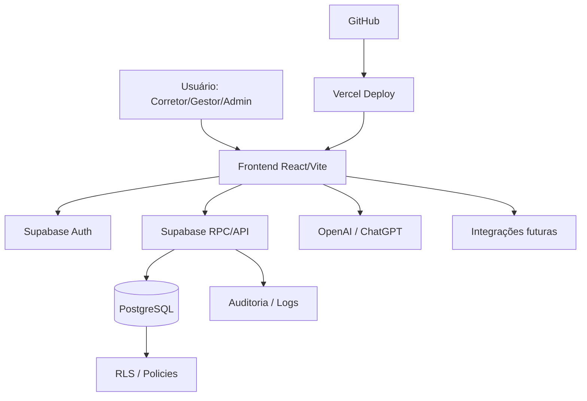

# FECH.AI — Arquitetura Atual

**Status:** rascunho profissional  
**Área:** arquitetura técnica  
**Finalidade:** explicar a estrutura técnica atual do produto para devs, suporte, sócios, compradores e parceiros.  
**Escopo:** documentação. Não altera código, banco ou infraestrutura.

---

## 1. Visão geral

O FECH.AI é uma aplicação SaaS baseada em frontend web, backend gerenciado pelo Supabase e integrações externas planejadas para IA, WhatsApp, e-mail e aquisição de leads.

Arquitetura simplificada:

```text
Usuário
  ↓
Frontend React/Vite na Vercel
  ↓
Supabase Auth / Supabase Client / RPCs
  ↓
PostgreSQL + RLS + Functions
  ↓
Dados de leads, usuários, empresas, listas, simulações e operações
  ↓
Integrações: OpenAI/ChatGPT, WhatsApp/WABA, e-mail, Meta/Google
```

---

## 2. Componentes principais

| Componente | Tecnologia | Função |
|---|---|---|
| Frontend | React 18 + Vite | interface do usuário |
| Estilo | Tailwind CSS | layout e componentes visuais |
| Gráficos | Recharts | dashboards e indicadores |
| Hospedagem | Vercel | build, deploy e preview |
| Banco | Supabase PostgreSQL | dados estruturados do SaaS |
| Autenticação | Supabase Auth | login e sessão |
| Segurança | RLS, policies e RPCs | isolamento de tenant, empresa e perfil |
| Versionamento | GitHub | código, documentação, PRs e histórico |
| IA | OpenAI/ChatGPT | apoio assistivo e automações futuras |

---

## 3. Princípio arquitetural

Regra central:

```text
Frontend exibe e solicita.
Banco/RPC valida e decide.
IA auxilia, mas não é autoridade.
```

O frontend não deve ser fonte soberana para:

- tenant;
- empresa;
- perfil;
- permissão;
- regra financeira;
- acesso a proposta;
- ownership comercial;
- visibilidade cliente-safe;
- política interna;
- dado sensível.

---

## 4. Camadas da aplicação

### 4.1 Camada de apresentação

Responsável por telas, navegação, formulários, dashboards e experiência do usuário.

Exemplos:

- tela do corretor;
- dashboard gestor;
- MesaCliente;
- histórico;
- 2ª via read-only;
- painel de operações financeiras.

### 4.2 Camada de dados e autorização

Responsável por comunicação com Supabase, autenticação, RPCs e leitura de dados autorizados.

Deve sempre respeitar:

- sessão válida;
- `auth.uid()`;
- tenant/empresa;
- ownership/time;
- perfil/permissão;
- RLS;
- contratos de payload.

### 4.3 Camada de banco

Responsável por persistência, consistência, RLS, RPCs, auditoria e validações sensíveis.

É a camada de maior autoridade técnica.

### 4.4 Camada de IA e automações

Responsável por sugestões, geração de mensagens, apoio ao atendimento e análise assistida.

Não deve decidir acesso, regra financeira ou permissão.

---

## 5. Fluxo conceitual de uso

```text
Lead entra ou é importado
  ↓
Gestor distribui ou sistema atribui
  ↓
Corretor trabalha o lead
  ↓
Sistema exige feedback estruturado
  ↓
Dashboard mede produção e qualidade
  ↓
MesaCliente apoia negociação
  ↓
Histórico preserva proposta/fluxo
  ↓
Gestor acompanha resultado
```

---

## 6. Topologia lógica



---

## 7. Áreas sensíveis

Áreas que exigem maior controle:

| Área | Por quê |
|---|---|
| Supabase Auth | controla identidade |
| RLS | impede vazamento entre tenants/empresas |
| RPCs | executam regra sensível |
| MesaCliente | contém dados financeiros e comerciais |
| Histórico/2ª via | envolve ownership e visibilidade comercial |
| IA | pode trafegar dados sensíveis se mal usada |
| Variáveis de ambiente | podem conter chaves e segredos |

---

## 8. Pontos ainda a mapear com evidência real

Antes de venda, sociedade ou escala, confirmar:

```text
schema real do Supabase
todas as tabelas existentes
todas as RPCs aplicadas
grants e policies reais
ambientes Vercel e variáveis
uso real de OpenAI/ChatGPT
rotina de backup
logs disponíveis
custos mensais atuais
```

---

## 9. Próximo documento relacionado

Ler:

```text
docs/03-infraestrutura-cloud/topologia-cloud.md
docs/04-banco-de-dados/mapa-tabelas.md
docs/05-observabilidade-ha/observabilidade-non-stop.md
```
