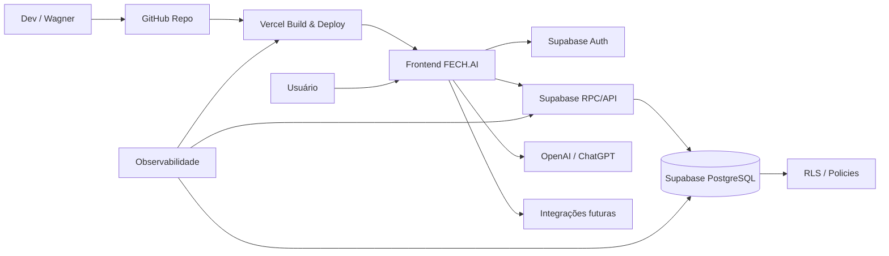

# FECH.AI — Topologia Cloud

**Status:** rascunho profissional  
**Área:** infraestrutura cloud  
**Finalidade:** documentar como o FECH.AI está organizado na nuvem e quais dependências precisam ser controladas.  
**Escopo:** GitHub, Vercel, Supabase, OpenAI/ChatGPT, domínio/DNS, observabilidade e integrações futuras.

---

## 1. Visão geral

A estrutura atual do FECH.AI usa serviços gerenciados para acelerar implantação e reduzir carga operacional inicial.

Topologia conceitual:

```text
GitHub
  ↓ deploy/build
Vercel
  ↓ frontend web
Usuário
  ↓ autenticação e dados
Supabase Auth + PostgreSQL + RPC/RLS
  ↓ assistência
OpenAI/ChatGPT
  ↓ canais futuros
WhatsApp/WABA, e-mail, Meta, Google
```

---

## 2. Componentes cloud

| Camada | Serviço | Responsabilidade |
|---|---|---|
| Código-fonte | GitHub | repositório, branches, PRs, histórico e documentação |
| Deploy web | Vercel | build, preview, produção e rollback de frontend |
| Banco/Auth | Supabase | PostgreSQL, Auth, RLS, RPCs e logs de banco |
| IA | OpenAI/ChatGPT | geração assistida, análise e suporte a automações |
| Domínio/DNS | a documentar | apontamento para Vercel e serviços auxiliares |
| Observabilidade | a definir/consolidar | uptime, logs, alertas, métricas e incidentes |
| Integrações futuras | WABA, e-mail, Meta, Google | aquisição, comunicação e automação |

---

## 3. GitHub

Deve documentar:

```text
repositório oficial
branch principal
branches ativas
padrão de PR
proteção de branch, se houver
Actions/workflows
migrations versionadas
padrão de documentação
controle de changelog
```

Regras:

```text
Não versionar segredo.
Não versionar HAR com credencial.
Não versionar chave service_role.
Não alterar main sem PR/revisão quando houver mudança relevante.
```

---

## 4. Vercel

Deve documentar:

```text
nome do projeto Vercel
time/conta responsável
branch de produção
build command
output directory
variáveis de ambiente
preview deployments
production deployment
rollback de deploy
logs disponíveis
```

Pontos de atenção:

```text
Variáveis públicas começam com prefixo esperado do framework.
Variável sensível não pode ir para frontend.
service_role nunca deve ser exposta em build client-side.
```

---

## 5. Supabase

Deve documentar:

```text
projeto Supabase
região
plano contratado
PostgreSQL
Auth
RLS
RPCs/functions
policies
grants
backups
logs
auth providers
storage, se existir
edge functions, se existirem
```

Regras críticas:

```text
Banco/RPC é fonte de verdade.
RLS deve proteger dados por tenant/empresa/perfil.
anon não deve executar RPC sensível.
service_role não deve aparecer no frontend.
```

---

## 6. OpenAI / ChatGPT

Uso esperado:

```text
gerar mensagens assistidas
classificar contexto comercial
sugerir próxima ação
apoiar suporte e documentação
analisar dados quando permitido
```

Regras:

```text
Não enviar segredo.
Não enviar senha.
Não enviar token.
Não enviar dado sensível sem necessidade e sem política.
Não usar IA como autoridade de permissão, tenant ou regra financeira.
```

---

## 7. Domínio e DNS

Documentar:

```text
domínio principal
subdomínios
provedor DNS
apontamentos para Vercel
apontamentos para APIs, se existirem
certificados TLS
renovação do domínio
responsável pelo acesso
```

---

## 8. Observabilidade e alertas

Mínimo recomendado:

```text
monitoramento de uptime do frontend
alerta de deploy falho
logs de erro frontend
logs Supabase/RPC
alertas de indisponibilidade
alerta de custo/limite
monitoramento de uso de IA
```

Ferramentas possíveis:

```text
Vercel Analytics/Logs
Supabase Logs
Sentry
UptimeRobot
Better Stack
Grafana/Prometheus em fase futura
```

---

## 9. Alta disponibilidade

A disponibilidade depende dos serviços gerenciados.

Documentar:

```text
SLA contratado da Vercel
SLA contratado do Supabase
plano de contingência se Vercel cair
plano de contingência se Supabase cair
plano de contingência se OpenAI cair
backup e restore
RTO
RPO
```

---

## 10. Topologia Mermaid



---

## 11. Pendências para versão oficial

Validar e preencher:

```text
nomes reais dos projetos Vercel/Supabase
domínios reais
variáveis de ambiente existentes
plano contratado de cada serviço
rotina de backup real
ferramenta oficial de observabilidade
custos mensais atuais
responsáveis por cada acesso
```
