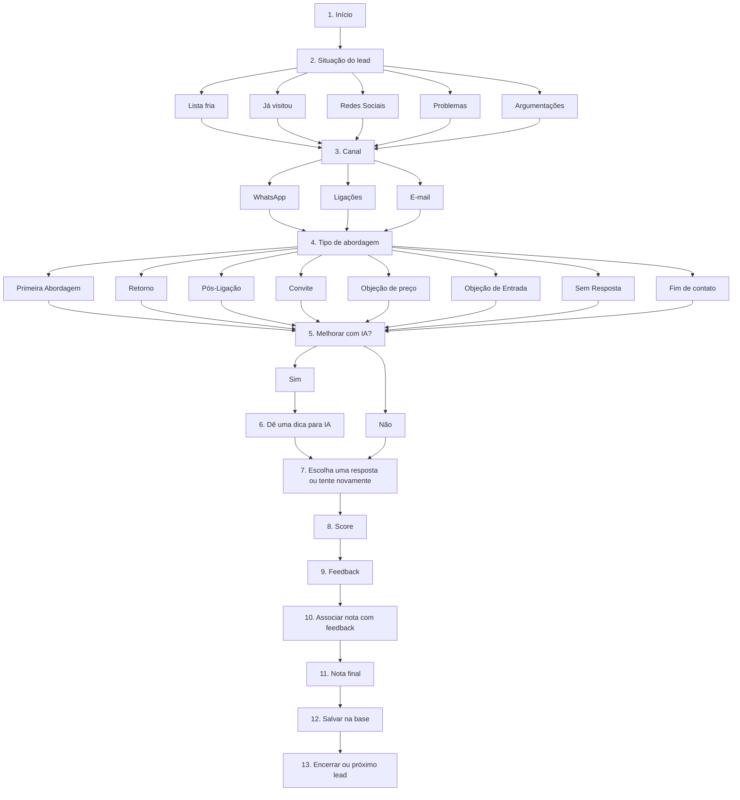

# Fluxo 13 níveis — Discador Flow AI / PME v0.1

## Visão geral

Fluxo funcional inicial para transformar discador + PME + IA em uma jornada guiada de atendimento.

---

## Nível 1 — Início

Entrada do corretor no fluxo operacional do lead ativo.

Dados mínimos desejáveis:

- lead_id;
- nome;
- telefone;
- origem;
- empreendimento, quando existir;
- corretor autenticado;
- empresa/tenant resolvido pelo backend/banco.

---

## Nível 2 — Situação do lead

Badges principais:

- Lista fria;
- Já visitou;
- Redes Sociais;
- Problemas;
- Argumentações.

Esses badges determinam o contexto comercial inicial.

---

## Nível 3 — Canal

O corretor escolhe o canal:

- WhatsApp;
- Ligações;
- E-mail.

Regra: canal muda o formato da saída. Não deve haver três botões com função parecida confundindo o corretor.

---

## Nível 4 — Tipo de abordagem

Opções iniciais:

- Primeira abordagem;
- Retorno;
- Pós-ligação;
- Convite;
- Objeção de preço;
- Objeção de entrada;
- Sem resposta;
- Fim de contato.

---

## Nível 5 — Melhorar com IA?

Opção simples:

- Sim;
- Não.

Se não, usa texto da base PME.
Se sim, abre campo de dica.

---

## Nível 6 — Dica para IA

Campo curto para o corretor orientar a IA.

Exemplos:

- cliente achou caro;
- cliente quer entrada menor;
- cliente pediu para falar com esposa;
- cliente já visitou e está comparando;
- lead veio do Instagram e está frio.

---

## Nível 7 — Escolha uma ou tente novamente

A IA ou a base PME deve exibir opções reaproveitáveis.

Ações possíveis:

- usar esta;
- editar manualmente;
- pedir nova versão;
- copiar;
- abrir WhatsApp;
- preparar e-mail;
- copiar fala de ligação.

---

## Nível 8 — Score

Score operacional simples para o MVP.

Sugestão inicial:

- 0 = ruim / não útil;
- 1 = neutra;
- 2 = útil;
- 3 = muito útil;
- 4 = alta chance de avanço;
- 5 = converteu ou gerou ação forte.

---

## Nível 9 — Feedback

Feedback continua sendo decisão do corretor.

Não automatizar feedback por IA no MVP.

---

## Nível 10 — Associar nota com feedback

A resposta usada deve ser associada ao feedback final para medir efetividade.

Exemplo:

- origem: Lista fria;
- canal: WhatsApp;
- abordagem: Primeira abordagem;
- texto usado: script_id ou resposta_ia_id;
- score: 4;
- feedback: enviado_informacoes.

---

## Nível 11 — Nota final

Nota final pode combinar:

- score do corretor;
- feedback;
- canal;
- ação executada;
- se houve resposta do cliente futuramente.

No MVP, a nota pode começar simples e evoluir depois.

---

## Nível 12 — Salvar na base

Salvar evento de uso para aprendizado.

No MVP, antes de criar tabela definitiva, o contrato técnico deve definir se isso será mock/local/log controlado ou tabela auditável no Supabase.

---

## Nível 13 — Encerrar ou próximo lead

O fluxo termina com uma das ações:

- salvar e voltar ao lead;
- salvar e próximo lead;
- salvar e agendar retorno;
- salvar e finalizar contato.

---

## Observação de UX

No celular, o fluxo deve parecer um assistente guiado, não um painel técnico espremido. Corretor em plantão ou ligação não tem tempo para lutar contra botão. O sistema precisa trabalhar para ele, não o contrário.